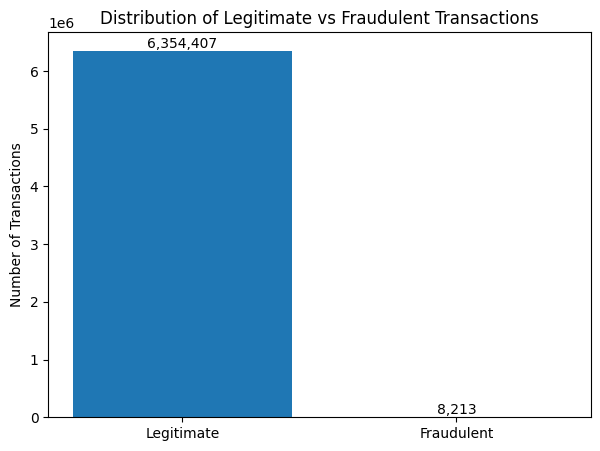
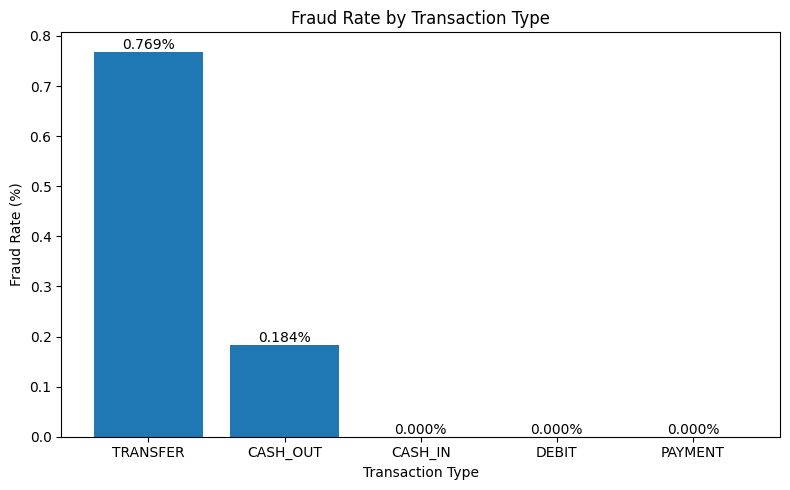
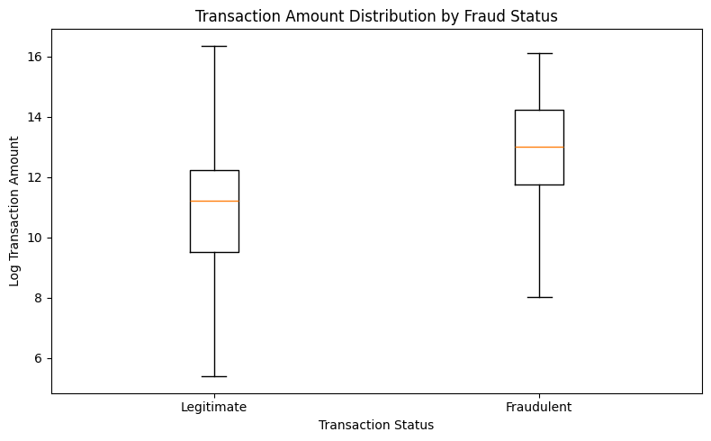
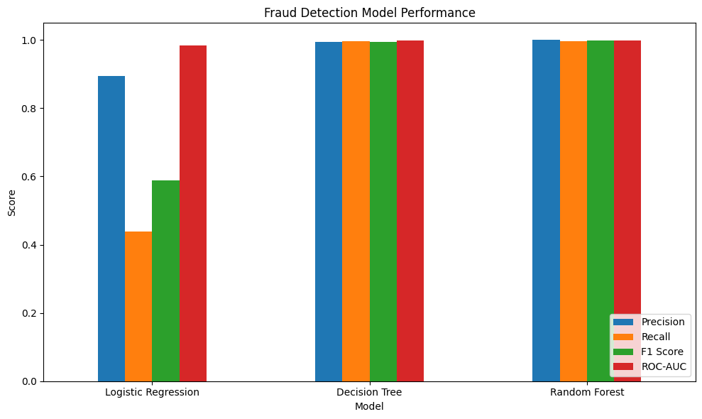
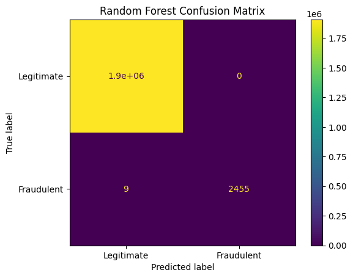
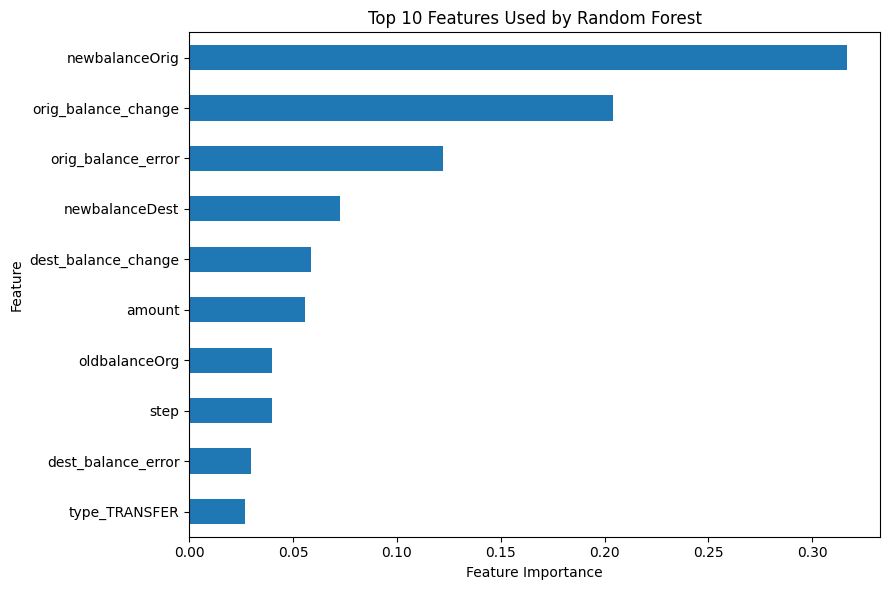

# 💳 Online Payment Fraud Detection

> Large-scale fraud analytics and machine learning project analyzing 6.3M+ financial transactions to identify fraudulent behavior and evaluate detection approaches.

## 📌 Project Overview

This project analyzes **6,362,620 online payment transactions** to identify patterns associated with fraudulent activity and evaluate data-driven fraud detection techniques.

The analysis combines **exploratory data analysis, feature engineering, supervised machine learning, and anomaly detection** to investigate transaction behavior and identify indicators associated with fraud.

Three classification models were evaluated:

- Logistic Regression
- Decision Tree
- Random Forest

The project focuses particularly on the challenges of **highly imbalanced financial-security data**, where fraudulent transactions represent only **0.13%** of the dataset.

## 🎯 Objectives

- Identify transaction patterns associated with fraudulent activity.
- Analyze fraud risk across different transaction types and amounts.
- Engineer behavioral features from account balance information.
- Compare machine-learning approaches for fraud classification.
- Evaluate models using precision, recall, F1-score, and ROC-AUC.
- Explore anomaly detection for identifying unusual transaction behavior.

## 🛠️ Technologies

`Python` `Pandas` `NumPy` `Scikit-learn` `PyOD` `Matplotlib` `Google Colab`

## 🔍 Analysis Workflow

**Data Quality Assessment → Exploratory Data Analysis → Fraud Pattern Analysis → Feature Engineering → Machine Learning → Model Evaluation → Anomaly Detection → Security Insights**

---

## 📊 Key Results & Visualizations

### 1. Fraud is Rare and Highly Imbalanced

Only **8,213 of 6,362,620 transactions (0.13%)** were fraudulent, compared with more than 6.35 million legitimate transactions.

This extreme imbalance demonstrates why accuracy alone can be misleading when evaluating fraud-detection models.

### 2. Fraud is Concentrated in Specific Transaction Types

Fraudulent activity occurred only within **TRANSFER** and **CASH_OUT** transactions in this dataset.

- **TRANSFER:** 4,097 fraudulent transactions — approximately **0.77% fraud rate**
- **CASH_OUT:** 4,116 fraudulent transactions — approximately **0.18% fraud rate**
- **PAYMENT, CASH_IN and DEBIT:** no fraudulent transactions were observed

### 3. Fraudulent Transactions Tend to Involve Larger Amounts

The median fraudulent transaction amount was approximately **$441,423**, compared with approximately **$74,685** for legitimate transactions.

This suggests transaction amount provides useful discriminatory information, although transaction amount alone is insufficient to identify fraud.

### 4. Machine Learning Model Comparison

Three supervised classification models were evaluated using precision, recall, F1-score, and ROC-AUC.

| Model | Precision | Recall | F1-Score | ROC-AUC |
|---|---:|---:|---:|---:|
| Logistic Regression | 89.47% | 43.79% | 58.80% | 98.35% |
| Decision Tree | 99.35% | 99.59% | 99.47% | 99.80% |
| **Random Forest** | **100.00%** | **99.63%** | **99.82%** | **99.82%** |

Random Forest produced the strongest overall performance. Logistic Regression demonstrated why high accuracy alone is insufficient: despite achieving approximately 99.92% accuracy, its fraud recall was only **43.79%**.

### 5. Random Forest Fraud Detection

On the held-out test set, the Random Forest model:

- Correctly detected **2,455 of 2,464 fraudulent transactions**
- Missed only **9 fraudulent transactions**
- Produced **0 false-positive fraud classifications**
- Achieved **99.63% fraud recall**

### 6. Feature Engineering Improved Detection

Balance-change and balance-discrepancy features were engineered from the original account balance fields.

A robustness comparison showed that Random Forest fraud recall increased from **77.80% using the original features** to **99.63% with the engineered features**.

Feature-importance analysis showed that sender balance behavior was particularly informative, with `newbalanceOrig`, `orig_balance_change`, and `orig_balance_error` among the strongest predictors.

### 7. Anomaly Detection

KNN-based unsupervised anomaly detection was also explored.

Within a deliberately constructed 50,000-transaction evaluation sample, **183 of 2,000 known fraudulent transactions (9.15%)** were identified as anomalies.

The result highlights an important distinction: **anomalous behavior is not necessarily fraudulent behavior**. Supervised classification was substantially more effective for detecting the known fraud cases in this labeled dataset.
